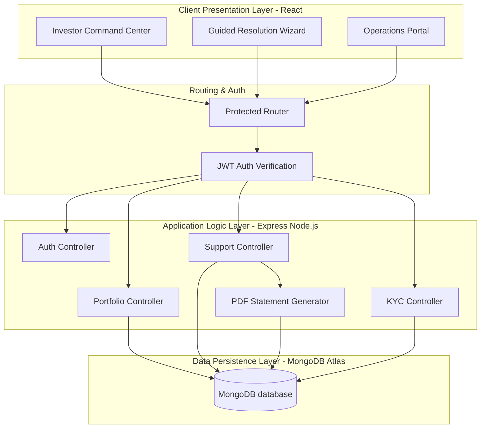

# System Architecture & Database ER Diagrams

This document contains standard Mermaid.js diagrams mapping the technical design of the InvestEase Platform. You can render these directly in GitHub, standard markdown viewers, or copy-paste the code into Mermaid Live Editor (mermaid.live) to download high-resolution PNGs for your hackathon slide deck.

---

## 🏛️ System Architecture

InvestEase follows a classic **3-Tier Web Application Architecture** designed to secure investor data, execute self-service actions, and provide administrative oversight.

---

## 📊 Database Entity-Relationship (ER) Diagram

Below is the database schema design mapping the structural relationships between Investors, Portfolios, Investments, SIPs, KYC documents, Nominees, Support Tickets, and Activity Notifications.

```mermaid
erDiagram
    USER ||--|| PORTFOLIO : "owns"
    USER ||--o{ INVESTMENT : "holds"
    USER ||--o{ SIP : "configures"
    USER ||--|| KYC : "submits"
    USER ||--o{ NOMINEE : "designates"
    USER ||--o{ REQUEST : "submits"
    USER ||--o{ STATEMENT : "generates"
    USER ||--o{ NOTIFICATION : "receives"

    USER {
        ObjectId id PK
        string name
        string email
        string password
        string role "investor | admin"
        string mobile
        date createdAt
    }

    PORTFOLIO {
        ObjectId id PK
        ObjectId userId FK
        number totalValue
        number todayChange
        object allocation "equity/debt/liquid"
        date updatedAt
    }

    INVESTMENT {
        ObjectId id PK
        ObjectId userId FK
        string fundName
        string type "Equity | Debt | Liquid"
        number amount
        number units
        number currentValue
    }

    SIP {
        ObjectId id PK
        ObjectId userId FK
        string fundName
        number amount
        number frequency "Monthly | Weekly"
        number nextDebitDate
        string status "Active | Paused | Completed"
    }

    KYC {
        ObjectId id PK
        ObjectId userId FK
        string panPath
        string aadhaarPath
        string addressProofPath
        string status "Pending | Approved | Rejected"
        string remarks
        date updatedAt
    }

    NOMINEE {
        ObjectId id PK
        ObjectId userId FK
        string name
        string relationship
        number allocationPercentage
        string panNumber
    }

    REQUEST {
        ObjectId id PK
        ObjectId userId FK
        string subject
        string message
        string status "Open | In-Progress | Resolved"
        string adminResponse
        date createdAt
    }

    STATEMENT {
        ObjectId id PK
        ObjectId userId FK
        string title
        string month
        string filePath
        date createdAt
    }

    NOTIFICATION {
        ObjectId id PK
        ObjectId userId FK
        string title
        string message
        string type "Success | Alert | Info"
        date createdAt
    }
```

